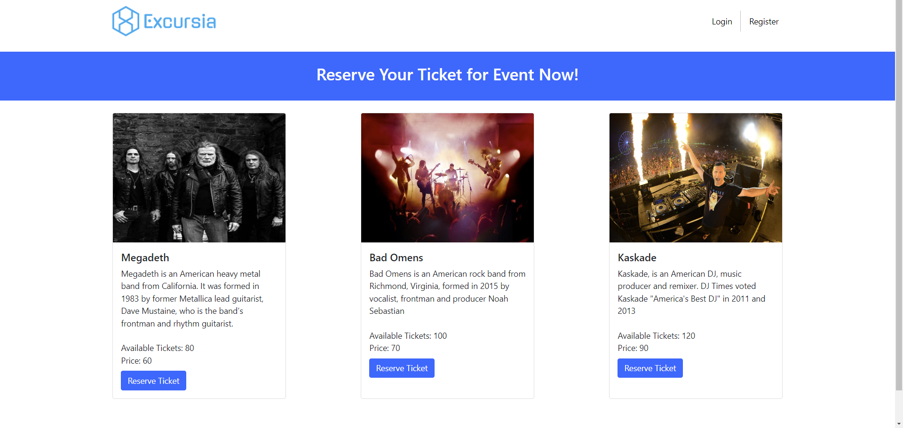

<p align="center">
  <a href="http://nestjs.com/" target="blank"></a>
  
</p>

[circleci-image]: https://img.shields.io/circleci/build/github/nestjs/nest/master?token=abc123def456
[circleci-url]: https://circleci.com/gh/nestjs/nest

  <p align="center">A progressive <a href="http://nodejs.org" target="_blank">Node.js</a> framework for building efficient and scalable server-side applications.</p>
    <p align="center">
<a href="https://www.npmjs.com/~nestjscore" target="_blank"></a>
<a href="https://www.npmjs.com/~nestjscore" target="_blank"></a>
<a href="https://www.npmjs.com/~nestjscore" target="_blank"></a>
<a href="https://circleci.com/gh/nestjs/nest" target="_blank"></a>
<a href="https://coveralls.io/github/nestjs/nest?branch=master" target="_blank"></a>
<a href="https://discord.gg/G7Qnnhy" target="_blank"></a>
<a href="https://opencollective.com/nest#backer" target="_blank"></a>
<a href="https://opencollective.com/nest#sponsor" target="_blank"></a>
  <a href="https://paypal.me/kamilmysliwiec" target="_blank"></a>
    <a href="https://opencollective.com/nest#sponsor"  target="_blank"></a>
  <a href="https://twitter.com/nestframework" target="_blank"></a>
</p>
  <!--[](https://opencollective.com/nest#backer)
  [](https://opencollective.com/nest#sponsor)-->

# Excursia




#### Motivation

I always wanted to build a microservices backend app that can handle a common issues in real world usecases and that is race conditions. lets say there is a taylor swift event with only 50 tickets left and server received 100 requests with each request have atleast one ticket for reservation, how can we handle this issue?? using database transactions, locking, database isolation level and Rabbitmq VERY CAREFULLY! we can eliminate this issue.

#### Technologies

- Nestjs
- Handlebars
- Mongodb
- Stripe
- Nodemailer
- RabbitMQ
- Docker
- Kubernetes
- Google Cloud

#### Description

A Microservices Backend Nestjs MVC app for events & ticket reservation, allow user to authenticate and reserve any number of tickets. The app was heavily focused on ensuring it is a production reliable reservation app meaning it can handle concurrency, heavy requests loads and handling race conditions using mongoose optimistic concurrency and rabbitmq.

The app was load tested to handle over 5k requests making sure ticket reservation is optimized and race conditions wont errupt meaning thousand users can reserve tickets without read/write database confilict operations, using mongoose optimistic concurrency & transactions & rabbitmq.

## Installation

Make sure to have docker installed with rabbitmq image & mongodb atlas instance

```bash
$ npm install
```

````

## Running the app
Make sure to replace env variables like MONGO_URI with your mongoatlas uri config, stripe & nodemailer smtp secret.

```bash
# docker-compose up


````

## Test

```bash
# unit tests
$ npm run test

# e2e tests
$ npm run test:e2e

# test coverage
$ npm run test:cov
```

## Support

Nest is an MIT-licensed open source project. It can grow thanks to the sponsors and support by the amazing backers. If you'd like to join them, please [read more here](https://docs.nestjs.com/support).

## Stay in touch

- Author - [Kamil Myśliwiec](https://kamilmysliwiec.com)
- Website - [https://nestjs.com](https://nestjs.com/)
- Twitter - [@nestframework](https://twitter.com/nestframework)

## License

Nest is [MIT licensed](LICENSE).
